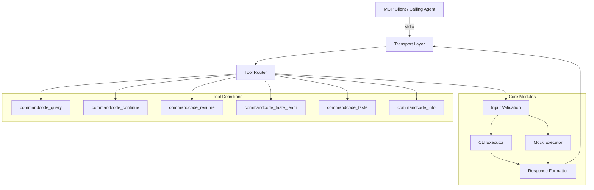
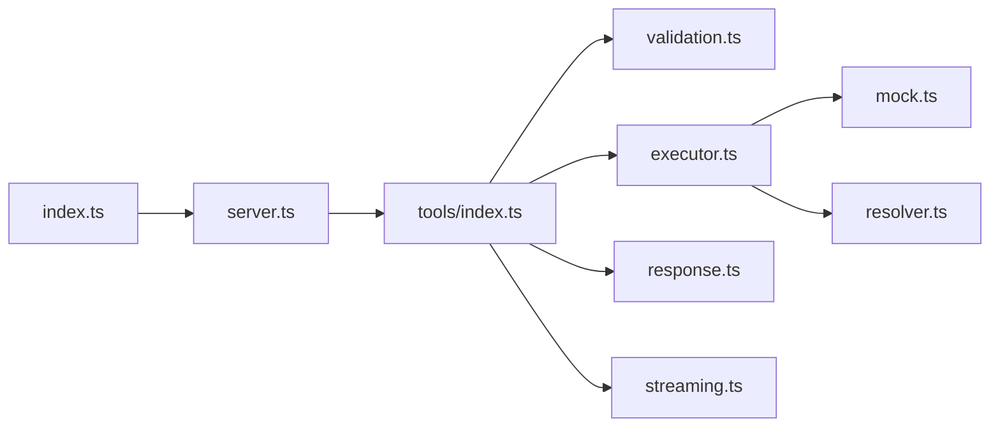

# Design Document: CommandCode MCP Server v2.0

## Overview

This design describes the modular architecture for the CommandCode MCP Server — a Node.js process that implements the Model Context Protocol over stdio transport, wrapping the CommandCode CLI to expose codebase intelligence as structured MCP tools.

The redesign addresses the following issues in the current single-file implementation:
- TypeScript type error (`isError` not in return type) due to incorrect SDK usage
- 10 tools exceeding the 7-tool maximum (consolidating overlapping tools)
- No configurable timeout (hardcoded 120s, no partial output collection)
- Missing `--skip-onboarding` on all invocations
- No mock mode for testing
- No queue management for continue tool
- No `context_dirs` support on query tool
- Monolithic file with no separation of concerns

**Key Design Decisions:**
1. **Modular file structure** — separate validation, execution, response formatting, and tool definitions
2. **7 tools maximum** — consolidate `commandcode_info`, `commandcode_status`, and `commandcode_whoami` into a single `commandcode_info` tool; drop `commandcode_feedback` (interactive) and `commandcode_skills` (interactive); keep `commandcode_query`, `commandcode_continue`, `commandcode_resume`, `commandcode_taste_learn`, `commandcode_taste`
3. **Configurable timeout** — default 300s, max 900s, with partial output collection on timeout
4. **Mock mode** — `COMMANDCODE_MOCK=true` bypasses spawning and returns deterministic responses
5. **Explicit continue queue** — bounded queue (max 10) exposed to the caller via a `queue` parameter, so the calling agent can choose between queuing behind in-flight requests or spawning a fresh query
6. **Streaming output** — optional progressive output delivery via MCP progress notifications, so calling agents receive partial results as the CLI produces them
7. **Model selection** — optional `model` parameter on query/continue/resume tools, passed through to CommandCode CLI as `--model <value>`

## Architecture

The server follows a layered architecture with clear separation of concerns:



### Module Dependency Flow



### File Structure

```
src/
├── index.ts              # Entry point, shebang, starts server
├── server.ts             # McpServer setup, transport, signal handling
├── constants.ts          # Shared constants (limits, defaults)
├── types.ts              # Shared TypeScript interfaces
├── validation.ts         # Input validation functions (pure)
├── executor.ts           # CLI spawning, timeout, process management
├── streaming.ts          # Progressive output delivery via MCP notifications
├── mock.ts               # Mock executor for testing
├── resolver.ts           # CommandCode binary path resolution
├── response.ts           # Response formatting (toToolResult, error formatting)
├── queue.ts              # Bounded continue queue with caller-visible status
└── tools/
    ├── index.ts          # Tool registration orchestrator
    ├── query.ts          # commandcode_query tool
    ├── continue.ts       # commandcode_continue tool
    ├── resume.ts         # commandcode_resume tool
    ├── taste-learn.ts    # commandcode_taste_learn tool
    ├── taste.ts          # commandcode_taste tool
    └── info.ts           # commandcode_info tool (combined info+status)
```

## Components and Interfaces

### 1. Entry Point (`index.ts`)

Minimal entry point with shebang line. Creates and starts the server.

```typescript
#!/usr/bin/env node
import { CommandCodeMcpServer } from "./server.js";

const server = new CommandCodeMcpServer();
server.run().catch((err) => {
  console.error(`Fatal: ${err.message}`);
  process.exit(1);
});
```

### 2. Server (`server.ts`)

```typescript
export class CommandCodeMcpServer {
  private server: McpServer;

  constructor();
  async run(): Promise<void>;  // connect transport, health check, log version
  private async shutdown(): Promise<void>;  // graceful SIGINT/SIGTERM
}
```

### 3. Constants (`constants.ts`)

```typescript
export const MAX_QUERY_LENGTH = 100_000;
export const MAX_PATH_LENGTH = 4_096;
export const MAX_SESSION_NAME_LENGTH = 512;
export const MAX_CONTEXT_DIRS = 10;
export const DEFAULT_TIMEOUT_SECONDS = 300;
export const MAX_TIMEOUT_SECONDS = 900;
export const STARTUP_CHECK_TIMEOUT_MS = 10_000;
export const MAX_PARTIAL_OUTPUT_CHARS = 10_000;
export const MAX_CONTINUE_QUEUE_SIZE = 10;
export const STREAM_CHUNK_INTERVAL_MS = 500;
export const IS_WINDOWS = process.platform === "win32";
```

### 4. Types (`types.ts`)

```typescript
export interface CommandCodeResult {
  stdout: string;
  stderr: string;
  code: number | null;
  timedOut: boolean;
  elapsedMs: number;
}

export interface ExecutionOptions {
  args: string[];
  cwd?: string;
  timeoutSeconds: number;
  stream?: boolean;           // Enable progressive output notifications
  onChunk?: (chunk: string) => void;  // Callback for each stdout chunk
}

export interface ToolResponse {
  content: Array<{ type: "text"; text: string }>;
  isError?: boolean;
}

export interface QueueStatus {
  position: number;    // 0 = executing now, 1+ = waiting
  queueSize: number;   // Total items in queue including current
}
```

### 5. Validation Module (`validation.ts`)

Pure functions — no side effects, easily testable.

```typescript
export function validateQuery(value: string): string;
export function validatePath(value: string, paramName: string): string;
export function validateSessionName(value: string): string;
export function validateWorkingDir(value: string | undefined): string | undefined;
export function validateContextDirs(dirs: string[] | undefined): string[] | undefined;
export function validateTimeoutSeconds(value: number | undefined): number;
export function hasPathTraversal(s: string): boolean;
export function hasShellMetachar(s: string): boolean;  // Windows-only check
```

### 6. Executor Module (`executor.ts`)

Handles CLI spawning with timeout, partial output collection, and optional streaming.

```typescript
export async function executeCommandCode(options: ExecutionOptions): Promise<CommandCodeResult>;
```

Key behaviors:
- Spawns with `shell: true` on Windows, `shell: false` on Unix
- Applies timeout via `AbortController` + `setTimeout`
- On timeout: kills process, collects up to 10,000 chars of partial output
- Checks `COMMANDCODE_MOCK` env var and delegates to mock executor if set
- If `options.stream` is true and `options.onChunk` is provided, calls `onChunk` with each stdout data event as it arrives (debounced to 500ms intervals to avoid flooding)
- If `--model` is present in args, passes it through to the CLI unchanged

### 7. Mock Executor (`mock.ts`)

```typescript
export function executeMock(toolName: string, params: Record<string, unknown>): ToolResponse;
```

Returns deterministic responses including tool name and received parameters for assertion-based testing.

### 8. Resolver (`resolver.ts`)

```typescript
export function resolveCommandCodePath(): { command: string; args: string[] };
export async function checkCommandCodeAvailable(): Promise<boolean>;
```

Resolution order:
1. `COMMANDCODE_PATH` environment variable
2. Global npm install path (Windows APPDATA)
3. Fallback: `cmd /c cmc` (Windows) or `cmc` (Unix)

### 9. Response Formatter (`response.ts`)

```typescript
export function formatSuccess(result: CommandCodeResult): ToolResponse;
export function formatError(message: string): ToolResponse;
export function formatTimeout(result: CommandCodeResult, elapsedSeconds: number): ToolResponse;
export function formatCombinedInfo(infoResult: CommandCodeResult, statusResult: CommandCodeResult): ToolResponse;
```

Handles:
- Exit code 0 → success response
- Non-zero exit code → `isError: true` with "Command Code exited with code N" prefix
- Timeout → `isError: true` with partial output and elapsed time
- Spawn failure → `isError: true` with failure reason
- Combined stdout + stderr formatting (stderr prefixed with "STDERR:")

### 10. Queue (`queue.ts`)

```typescript
export class ContinueQueue {
  private pending: Array<{ fn: () => Promise<unknown>; resolve: Function; reject: Function }>;
  private running: boolean;
  private maxSize: number;

  constructor(maxSize: number);
  async enqueue<T>(fn: () => Promise<T>): Promise<{ result: T; queueStatus: QueueStatus }>;
  get size(): number;
  get isFull(): boolean;
}
```

A bounded queue that serializes `commandcode_continue` execution. The queue is **explicitly exposed to the calling agent**:

- The `commandcode_continue` tool accepts an optional `queue` boolean parameter (default: `true`)
- When `queue: true` — the request joins the queue. If the queue is full (10 pending), the request is rejected immediately with an error telling the caller to use `commandcode_query` instead
- When `queue: false` — the request bypasses the queue and executes immediately (caller accepts the risk of session state conflicts)
- The response metadata includes queue position info so the caller knows it was queued

This design gives the calling agent explicit control: it can choose to wait in line for session continuity, or spawn a fresh query if it doesn't need the session context.

### 11. Streaming Module (`streaming.ts`)

```typescript
export interface StreamingContext {
  sendProgress(chunk: string, progress: number): void;
}

export function createStreamingContext(server: McpServer, requestId: string): StreamingContext;
```

Progressive output delivery using MCP progress notifications:

- When a tool is invoked with `stream: true`, the executor pipes stdout chunks to the calling agent as progress notifications
- Chunks are debounced (500ms interval) to avoid flooding the transport
- Each notification includes the new text chunk and an estimated progress percentage (based on elapsed time vs timeout)
- The final complete response is still returned as the normal tool result
- If the client doesn't support progress notifications, streaming is silently disabled (no error)

**Streaming behavior:**
1. Tool handler creates a `StreamingContext` from the server and request ID
2. Passes `onChunk` callback to the executor that calls `streamingContext.sendProgress(chunk, progress)`
3. Executor emits chunks as stdout data arrives (debounced)
4. On completion, the full result is returned as the standard tool response

**Client compatibility:** Streaming is opt-in via the `stream` parameter. Clients that don't understand progress notifications simply ignore them and wait for the final response.

### 11. Tool Definitions

Each tool file exports a registration function:

```typescript
// tools/query.ts
export function registerQueryTool(server: McpServer): void;
```

**Final 6 Tools:**

| Tool Name | CLI Command | Description |
|-----------|-------------|-------------|
| `commandcode_query` | `cmc --skip-onboarding [--model M] [-p query] [--plan] [--add-dir ...]` | One-shot codebase query (supports streaming) |
| `commandcode_continue` | `cmc -c --skip-onboarding [--model M] -p <query>` | Continue last session (queued, supports streaming) |
| `commandcode_resume` | `cmc --resume [name] --skip-onboarding [--model M] -p <query>` | Resume named session (supports streaming) |
| `commandcode_taste_learn` | `cmc taste learn <source>` | Learn taste from repo |
| `commandcode_taste` | `cmc taste` | List/manage taste profiles |
| `commandcode_info` | `cmc info` + `cmc status` | Combined system info |

## Data Models

### Tool Input Schemas (Zod)

**commandcode_query:**
```typescript
{
  query: z.string().min(1).max(100_000),
  working_dir: z.string().optional(),
  plan_mode: z.boolean().optional().default(false),
  context_dirs: z.array(z.string()).max(10).optional(),
  model: z.string().max(100).optional(),
  stream: z.boolean().optional().default(false),
  timeout_seconds: z.number().int().min(1).max(900).optional()
}
```

**commandcode_continue:**
```typescript
{
  query: z.string().min(1).max(100_000),
  working_dir: z.string().optional(),
  model: z.string().max(100).optional(),
  stream: z.boolean().optional().default(false),
  queue: z.boolean().optional().default(true),
  timeout_seconds: z.number().int().min(1).max(900).optional()
}
```

**commandcode_resume:**
```typescript
{
  session_name: z.string().max(512).optional(),
  query: z.string().min(1).max(100_000),
  working_dir: z.string().optional(),
  model: z.string().max(100).optional(),
  stream: z.boolean().optional().default(false),
  timeout_seconds: z.number().int().min(1).max(900).optional()
}
```

**commandcode_taste_learn:**
```typescript
{
  source: z.string().min(1).max(4_096),
  timeout_seconds: z.number().int().min(1).max(900).optional()
}
```

**commandcode_taste:**
```typescript
{
  timeout_seconds: z.number().int().min(1).max(900).optional()
}
```

**commandcode_info:**
```typescript
{
  timeout_seconds: z.number().int().min(1).max(900).optional()
}
```

### Response Format

**Success (exit code 0):**
```json
{
  "content": [{ "type": "text", "text": "<stdout or stderr or '(no output)'>" }]
}
```

**Error (non-zero exit code):**
```json
{
  "content": [{ "type": "text", "text": "Command Code exited with code 1\n\n<output>\nSTDERR: <stderr>" }],
  "isError": true
}
```

**Timeout:**
```json
{
  "content": [{ "type": "text", "text": "Command Code timed out after 300s\n\nPartial output:\n<first 10000 chars>" }],
  "isError": true
}
```

**Spawn failure:**
```json
{
  "content": [{ "type": "text", "text": "Failed to spawn CommandCode CLI: <reason>" }],
  "isError": true
}
```

### Mock Mode Response Format

When `COMMANDCODE_MOCK=true`:
```json
{
  "content": [{ "type": "text", "text": "MOCK: commandcode_query { \"query\": \"explain auth\", \"working_dir\": \"/project\" }" }]
}
```

## Correctness Properties

*A property is a characteristic or behavior that should hold true across all valid executions of a system — essentially, a formal statement about what the system should do. Properties serve as the bridge between human-readable specifications and machine-verifiable correctness guarantees.*

### Property 1: Input validation rejects dangerous inputs and accepts valid ones

*For any* string input, the validation functions SHALL:
- Accept query strings with length between 1 and 100,000 (inclusive) and reject those outside this range
- Accept path strings with length ≤ 4,096 that do not contain ".." or null bytes, and reject those that do
- Accept session names with length ≤ 512 that do not contain ".." or null bytes, and reject those that do
- On Windows, reject any string containing shell metacharacters (`&`, `|`, `<`, `>`, `^`, `%`, `!`)
- Accept working_dir values that are absolute paths and reject relative paths

**Validates: Requirements 9.1, 9.2, 9.3, 9.4, 9.5, 5.4, 6.3, 3.6, 1.1**

### Property 2: CLI argument construction produces correct flags for all tools

*For any* valid tool input parameters, the argument construction logic SHALL produce an args array that:
- For query: always contains `--skip-onboarding` and `-p` followed by the query string, and includes `--plan` iff plan_mode is true, and includes one `--add-dir <path>` pair for each entry in context_dirs, and includes `--model <value>` iff model is provided
- For continue: always contains `-c`, `--skip-onboarding`, and `-p` followed by the query string, and includes `--model <value>` iff model is provided
- For resume with session_name: always contains `--resume`, the session name, `--skip-onboarding`, and `-p` followed by the query, and includes `--model <value>` iff model is provided
- For taste_learn: always contains `taste`, `learn`, and the source string

**Validates: Requirements 3.1, 3.5, 3.7, 4.1, 5.1, 6.1**

### Property 3: Timeout validation normalizes values correctly

*For any* numeric input to validateTimeoutSeconds:
- Values between 1 and 900 (inclusive integers) SHALL pass through unchanged
- Values greater than 900 SHALL be capped to 900
- Values less than 1, zero, negative numbers, or non-integer values SHALL be rejected with an InvalidParams error
- Undefined/absent values SHALL resolve to the default of 300

**Validates: Requirements 10.2, 10.4, 10.5**

### Property 4: Success response formatting selects correct output

*For any* CommandCodeResult with exit code 0, the formatSuccess function SHALL return a ToolResponse where:
- If stdout is non-empty (after trimming), the text content equals the trimmed stdout
- If stdout is empty but stderr is non-empty (after trimming), the text content equals the trimmed stderr
- If both stdout and stderr are empty, the text content equals "(no output)"
- The response never includes `isError: true`

**Validates: Requirements 2.3, 11.1**

### Property 5: Error response formatting includes exit code and isError flag

*For any* CommandCodeResult with a non-zero exit code N and any output string, the formatError function SHALL return a ToolResponse where:
- `isError` is `true`
- The text content starts with "Command Code exited with code N"
- If both stdout and stderr are non-empty, stderr appears after a "STDERR:" prefix

*For any* spawn failure or timeout error message, the formatError function SHALL return a ToolResponse where:
- `isError` is `true`
- The text content does NOT contain "exited with code"

**Validates: Requirements 2.4, 11.2, 11.3, 11.4, 11.5**

### Property 6: Combined info formatting always includes labeled sections

*For any* pair of CommandCodeResult values (infoResult, statusResult), the formatCombinedInfo function SHALL:
- Always include "=== Info ===" and "=== Status ===" headers in the output text
- If one result has exit code 0 and the other non-zero, still include the successful output alongside the error
- If both results have non-zero exit codes, set `isError: true` and include both error outputs

**Validates: Requirements 8.1, 8.2, 8.3, 8.4**

### Property 7: Mock mode returns deterministic response containing tool name and parameters

*For any* tool name string and any parameter object, when COMMANDCODE_MOCK is "true", the executeMock function SHALL return a ToolResponse where:
- The response has no `isError` flag (or it is false)
- The text content contains the tool name
- The text content contains a JSON representation of the received parameters

**Validates: Requirements 15.4, 15.5**

### Property 8: Continue queue accepts up to max size, rejects overflow, and respects bypass

*For any* sequence of N concurrent calls to `commandcode_continue`:
- If `queue: true` (default) and queue size < 10, the request SHALL be accepted and executed sequentially
- If `queue: true` and queue size ≥ 10, the request SHALL be rejected immediately with an overload error
- If `queue: false`, the request SHALL execute immediately without entering the queue (concurrent execution allowed)
- All queued operations SHALL execute in FIFO order

**Validates: Requirements 4.2, 4.3, 4.5**

### Property 9: Path separator normalization matches host OS

*For any* valid path string containing mixed separators (both `/` and `\`), the normalization function SHALL:
- On Windows, replace all forward slashes with backslashes
- On Unix, replace all backslashes with forward slashes
- Preserve the path segments (splitting by either separator produces the same segments before and after normalization)

**Validates: Requirements 1.6**

### Property 10: Streaming delivers progressive output without altering final result

*For any* tool invocation with `stream: true` that produces stdout output:
- The streaming context SHALL emit at least one progress notification if the CLI produces output before completion
- The final tool response SHALL contain the complete stdout (identical to what would be returned with `stream: false`)
- Progress notifications SHALL be debounced to at most one per 500ms interval
- If the client does not support progress notifications, no error SHALL occur

**Validates: Requirements 3.8, 11.1**

### Property 11: Model parameter passes through to CLI unchanged

*For any* valid model string (1-100 characters, no shell metacharacters on Windows), the argument construction logic SHALL:
- Include `--model` followed by the exact model string in the args array
- Place `--model` before the `-p` flag in argument order
- If model is undefined/absent, NOT include `--model` in the args array

**Validates: Requirements 3.1, 4.1, 5.1**

## Error Handling

### Error Categories

| Category | Trigger | Response |
|----------|---------|----------|
| **Validation Error** | Invalid input params | `McpError(ErrorCode.InvalidParams, message)` thrown before execution |
| **Spawn Failure** | Binary not found, permission denied | `{ isError: true, content: "Failed to spawn CommandCode CLI: <reason>" }` |
| **Timeout** | Process exceeds configured timeout | `{ isError: true, content: "Command Code timed out after Ns\n\nPartial output:\n<up to 10000 chars>" }` |
| **CLI Error** | Non-zero exit code | `{ isError: true, content: "Command Code exited with code N\n\n<output>" }` |
| **Queue Overflow** | >10 pending continue requests | `{ isError: true, content: "Server overloaded: too many pending continue requests. Use commandcode_query for a fresh session instead." }` |
| **Transport Failure** | Stdio transport init fails | `process.exit(1)` |

### Error Handling Strategy

1. **Fail fast on validation** — all input checks run before any process spawn
2. **Graceful degradation** — startup health check failure logs warning but doesn't prevent operation
3. **Partial output preservation** — on timeout, collect whatever output was produced
4. **No silent failures** — every error path returns a structured response to the caller
5. **Signal handling** — SIGINT/SIGTERM trigger graceful shutdown within 5 seconds

### Process Cleanup

When a timeout occurs:
1. Send SIGTERM to the child process
2. Wait 2 seconds for graceful exit
3. If still running, send SIGKILL
4. Collect partial stdout/stderr (up to 10,000 chars)
5. Return timeout error response

## Testing Strategy

### Testing Framework

- **Unit tests**: Vitest (fast, TypeScript-native, ESM support)
- **Property-based tests**: fast-check (via Vitest integration)
- **Test location**: `src/__tests__/` directory

### Unit Tests

Unit tests cover specific examples and edge cases:

- **Validation functions**: boundary values (exactly at limit, one over), specific dangerous inputs
- **Argument construction**: each tool with all parameter combinations, including `--model` flag
- **Response formatting**: specific exit codes, empty outputs, combined outputs
- **Resolver**: env var precedence, fallback behavior
- **Queue**: sequential execution, overflow rejection, bypass mode
- **Streaming**: debounce timing, chunk delivery, graceful fallback when client doesn't support notifications

### Property-Based Tests

Property tests verify universal correctness across randomized inputs. Each property test:
- Runs minimum 100 iterations
- References its design document property via tag comment
- Uses fast-check arbitraries for input generation

```typescript
// Example tag format:
// Feature: commandcode-mcp-server, Property 1: Input validation rejects dangerous inputs and accepts valid ones
```

**Property test configuration:**
- Library: `fast-check` (npm package)
- Runner: Vitest
- Iterations: 100 minimum per property
- Seed: reproducible via fast-check's seed reporting

### Mock Mode Testing

When `COMMANDCODE_MOCK=true`:
- All tools return deterministic responses without spawning processes
- Enables CI/CD testing without CommandCode CLI installed
- Response includes tool name and received parameters for assertion

### Integration Testing

Manual integration test procedures documented in `TESTING.md`:
1. **Tool discovery**: Connect MCP client, verify 6 tools listed
2. **Query round-trip**: Send query, verify structured response
3. **Query with model**: Send query with `model` param, verify CLI receives `--model`
4. **Streaming**: Send query with `stream: true`, verify progress notifications arrive
5. **Continue flow**: Query → Continue → verify context preserved
6. **Continue queue**: Fire multiple continues, verify sequential execution and queue status
7. **Error scenarios**: Invalid params, timeout, binary not found, queue overflow
8. **Mock mode**: Set env var, verify deterministic responses

### Test File Structure

```
src/__tests__/
├── validation.test.ts        # Unit + property tests for validation
├── argument-builder.test.ts  # Unit + property tests for arg construction
├── response.test.ts          # Unit + property tests for response formatting
├── queue.test.ts             # Unit + property tests for ContinueQueue
├── streaming.test.ts         # Unit tests for streaming context and debounce
├── mock.test.ts              # Unit + property tests for mock executor
├── resolver.test.ts          # Unit tests for path resolution
└── timeout.test.ts           # Unit + property tests for timeout validation
```

